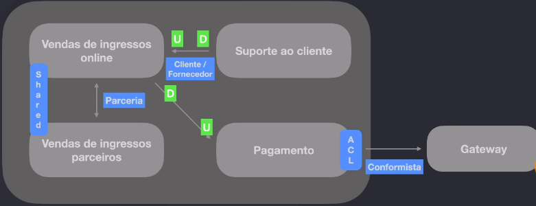

# Domain Driven Design (DDD)

- [Certificado](https://fullcycle.com.br/certificado/a03f43e3-7830-4a7b-9379-7a8e38f2bbb7)

## Introdução

  
Visualizar

- Projetos grandes onde não se tem clareza de tudo

- Clareza do que está desenvolvendo, sem misturar conceitos

- Projeto sustentável, durável a longo prazo

### Ponto de partida do DDD

- teórico, conceitual, princípios

- sw guiado ao **domínio**

- como modelar um sw para entender regras, complexidades

- Eric Evans, livro de 2003 - **filosofia**, exemplos gerais, patterns

- microservices de forma mais independente

- termos com significados diferentes em áreas diferentes da empresa

### Complexidades de um software

- DDD é para casos de projetos de sw complexos

  - não usar em sw de prateleira (soluções que são comercializadas já prontas no mercado, adaptáveis para qlq negócio, sem customizações)

- muitas pessoas envolvidas no projeto com diferentes visões em diferentes contextos, muitas áreas, muitas regras de negócio

- não há como não utilizar técnicas avançadas em projetos com alta complexidade

  - grande parte da complexidade desse tipo de sw NÃO vem da tecnologia, vem da comunicação, separação de contextos, compreensão do negócio

- pessoas

  - inocência x clareza

### Como DDD pode ajudar

- entender com profundidade o **domínio** e **subdomínios** da aplicação

- domínio -> função principal do que será desenvolvido -> **visão geral, mais macro**

- subdomínios -> pedaços, partes do sistema que em conjunto conseguem gerar e agregar valor -> **visão mais detalhada, mais micro**

- linguagem universal entre todos os envolvidos -> **linguagem ubíqua**

  - da especificação a variável

  - cada área da empresa tem seu jargão próprio

- criar **design estratégico** com uso de **Bounded contexts**

  - estratégia de modelagem para criar **contextos**

- criar **design tático** para conseguir mapear e agregar as **entidades e objetos** de valor da aplicação, bem como os **eventos** do domínio

- clareza do que é complexidade de negócio e o que é complexidade técnica

### Resumindo

- "In short, DDD is primarily about modeling a Ubiquitous Language in an explicitly Bounded Context." ([Domain-Driven Design Distilled, Vaughn Vernon](https://www.oreilly.com/library/view/domain-driven-design-distilled/9780134434964/ch02.html)

## Domínio, subdomínios e contextos

  
Visualizar
	
	
### Domínio vs subdomínio

- Domain é composto por:

  - **Core Domain** (domínio principal): coração do negócio, diferencial competitivo da empresa

  - **Support subdomain** (subdomínio de suporte): apoiar o domínio, faz com que a operação do domínio seja possível

  - **Generic subdomain** (subdomínio genérico): softwares auxiliares, não tem diferencial competitivo

### Espaço do problema vs espaço da solução

### O que é um contexto delimitado

- contexto delimitado -> bounded context

- "A Bounded Context is an explicit boundary within which a domain model exists. Inside the boundary, all terms and phrases of the Ubiquitous Language have a specific meaning, and the model reflects the Language with exactness." (Vaughn Vernon, Implementing Domain-Driven Design)

### Contexto é rei

- **A mesma palavra** ("ticket", por exemplo) terminologias iguais, com **significados diferentes** -> provavelmente estamos em contextos delimitados diferentes

  - Ticket: venda de ingressos

  - Ticket: suporte ao cliente

- Em um monolito -> criar entidades diferentes, criar alguma separação, modularizar o sistema. Sistema precisa trabalhar baseado em contexto

- **Se temos palavras diferentes** e que **significam a mesma coisa**, provavelmente está também em contextos diferentes

### Elementos transversais

- Estão de todos os lados mas com perspectivas diferentes (o "cliente" é o mesmo, mas as perspetivas são diferentes - ingresso x suporte)

  - Cliente: venda de ingressos

    - evento, ticket, local, vendedor

  - Cliente: suporte ao cliente
    - ticket, dúvida, departamento, responsável

- Cuidar na hora de modelar a classe, risco de criar uma classe gigante, os contextos são diferentes, as informações são diferentes
- Na hora de quebrar um monolito para microsserviços tem que reescrever tudo se nao estiver bem delimitado, se estiver em uma única classe servindo todo o sistema

  

## Visão estratégica

  
Visualizar

- Context Mapping

### Context mapping na prática

- Modelagem estratégica / Context Mapping
- Domain experts específicos para cada tipo de problema

- Shared kernel -> núcleo compartilhado

  - biblioteca, algo compartilhado entre os times, poderia ser um SDK

- Relação de parceria

- Relação Cliente/Fornecedor

  - um fornece o serviço e o outro consome

  - U -> upstream

  - D -> downstream

- Relação conformista

- ACL (Anticorruption Layer) - camada anticorrupção, é uma camada de adaptação, de interfaces, funciona como um adaptador

### Padrões e starter kit

- Padrões de Context Mapping

  - Partnership (padrão de parceria)

  - Shared kernel

  - Customer-Supplier Development (cliente/fornecedor)

  - Conformist (conformista)

  - Anticorruption Layer

  - Open host service

    - API REST

    - gRPC

  - Published language (linguagem publicada)

  - Separate ways

  - Big Ball of Mud

- Started kit

  - [Context Mapping - Github](https://github.com/ddd-crew/context-mapping)

  - [Remote Context Mapping Starter Kit for Miro](https://github.com/ddd-crew/context-mapping#remote-context-mapping-starter-kit-for-miro)

    - [Versão read-only version do starter kit no Miro](https://miro.com/app/board/o9J_kqtuB6A=/)

